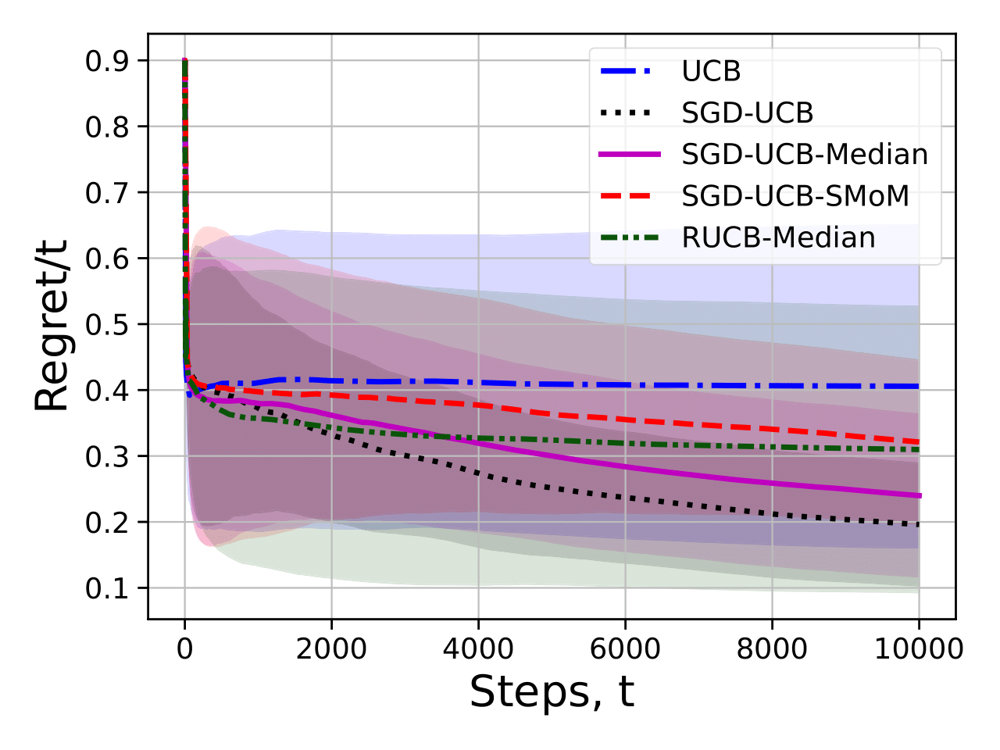

# Clipped-SGD-UCB

This repo provides implementation of **Clipped-SGD-UCB** algorithm implemented on python.

Presented algorithms are:

* Clipped-SGD-UCB (proposed)
* Classic UCB
* Rubust UCB-truncated
* Rubust UCB-median-of-means
* Rubust UCB-catoni-M-estimator
* Adaptive Perturbed Exploration

<p align="center">

</p>

## How to use

An example of usage can be found in 

## Installation

Requiring python3.9

to setup use poetry:

```
poetry build
```

or setup.py:

```
pip install -e . --force-reinstall
```

## code structure

### project structure

    .
    └── sgdbandit
        ├── __init__.py
        ├── environments
        │   ├── __init__.py
        │   └── envs.py
        ├── agents
        │   ├── __init__.py
        │   ├── abstract_agent.py
        │   ├── agent_init_funcs.py
        │   ├── arm_agent.py
        │   └── ucb_agents.py
        └── utils
            ├── __init__.py
            ├── algorithms.py
            ├── arms.py
            ├── function.py
            └── mean_estimators.py

### environments

You can make your own environment according to abstract class structure 

```python
    class AbstractEnv(ABC):
        def __init__(self, n_actions) -> None:
            self.n_actions = n_action

        @property
        def num_actions(self):
            return self.n_actions

        @abstractmethod
        def pull(self, action: tp.Any) -> int | float:
            raise NotImplementedError

        def optimal_reward(self) -> int | float:
            """
            returns expected reward of the best arm, optional
            """
            pass

        def action_reward(self, action: tp.Any) -> int | float:
            """
            returns expected reward of given action, optional
            """
            pass
```

There realized set of environments with different types of distribution on arms:

```python
class CauchyDistributionEnv
    """
    Environment with arms with noise distributed as Cauchy distribution
    https://en.wikipedia.org/wiki/Cauchy_distribution
    """
```

```python
class CauchyPlusExpDistributionEnv(RewardArrEnv):
    """
    arm noise distribution is
    f(x) = 0.7 * Cauchy(x) + 0.3 * Exp(x+1)
    """
```

```python
class CauchyPlusParetoEnv(RewardArrEnv):
    """
    arm noise distribution is
    f(x) = 0.7 * Cauchy(x) + 0.3 * 3/((x + 1.5)^4) * I[x >= -1.5]

    the second term is the density of the Pareto distribution
    """
```

```python
class FrechetDistribution(RewardArrEnv):
    """
    Environment with arms with noise distributed as Fréchet distribution
    https://en.wikipedia.org/wiki/Fréchet_distribution
```

### Agents

class factuey function for proposed methods

```python
def SGD_SMoM(n_actions, coeff, n=1, m=0, T: int = 10_000, R: float = 10.0, theta: float = 0.001, init_steps: int = 0):
    mean_estimator = mean_estimators.SMoM(n, m, theta=theta)
    arm = arms.SGDArm(mean_estimator, K, R)
    agent = arm_agent.ArmAgent(n_actions=n_actions, coeff=coeff, arm=arm, init_steps=init_steps)
    agent.name = "SGD-UCB"
    return agent
```

* ```R``` - is upper bound for rewards absolute value.
* ```init_steps``` - count of steps that algorithm pull arms to init optimizers. We recommend to use ```init_steps=1``` for light tail environments and ```init_steps=3``` for heavy tail distributions.
* ```theta``` - is a noise parameter for smoothing.
* ```T``` - planned budget for pulls.
* ```m``` and ```n``` parameters for SMoM. Algorithm do $(2m + 1)n$ pulls for each parameters update. We recommend to use default parameters.

```python
class ClassicUCB(AbstractAgent):
    def __init__(self, n_actions=5, R=0.99)
```

* ```R``` --  in article referred as $c$, is a confidence bound scale parameter.

```python
class RobustUCBMedian(AbstractAgent):
    def __init__(self, n_actions=5, eps=0.25, v=0.25)
```

* ```eps``` - distributions have moments of order $1 + \text{eps}$, eps \in (0; 1].
* ```v``` - variance factor for moment $1 + \text{eps}$

## Experiments from paper

### different distributions and arms experiment

 to run experiments with rewards for different noise distributions and true rewards select the desired algorithms, arms and rewards in  and run in termina:

```[python]
python ./experiment_helpers/experiment_setups/regret_experiment.py experiments_folder EXP_NAME
```

this will create the necessary directories and save the experiments in `experiments_folder` folder. To draw them, use 

### runtime comparison experiment

This is an experiment for runtime comparison. To run it, select appropriate parameters in  and run  in terminal:

```[python]
python ./experiment_helpers/experiment_setups/runtime_comparison.py runtime_comp.json
```

this will save experiment in `runtime_comp.json` file. To make table of runtimes, use 

### Delta experiment

This is a code to run experiment with arms [0,0,0,0,$\Delta$] and thus show how algorithms cope with complex environments. Select parameters in  for heavy tailed and  for light tailed reward noises. And then run:

```[python]
python ./experiment_helpers/experiment_setups/delta_light_tail.py delta_light.json
```

or

```[python]
python ./experiment_helpers/experiment_setups/delta_heavy_tail.py delta_heavy.json
```

this will save experiment in `delta_light.json`/`delta_heavy.json` file. To draw them use 

To make experiments be easily tried to run, we have commented out fewer algorithms and made fewer steps in the presented code. To run all the algorithms for the required number of steps and attempts, simply set the desired budget `K` and `n_trials` in experiment running codes.
